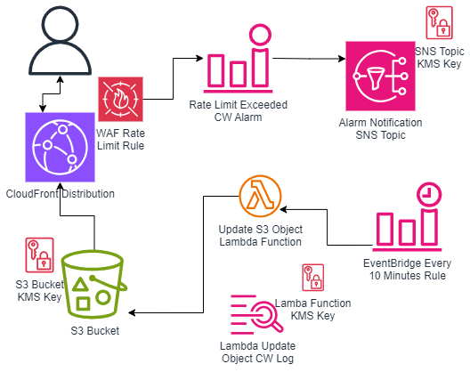

# DateTime Object
An AWS serverless application to generate an updated (every 10 minutes) S3 object that contains the last updated datetime stamp.

## Architecture


## Repository Structure
The DateTime solution is distributed as Terraform code in this Git repository.  There are 3 directories:
* images

    Contains architectual diagram attached above, along with the `draw.io` source.
* src

    Lambda source code in Python.
* terraform

    Terraform IaC code seperated into files based on AWS services.


```
├── README.md
├── images
│   ├── DateTimeS3Object.drawio
│   └── DateTimeS3Object.png
├── src
│   └── update_date_file.py
└── terraform
    ├── cloudfront.tf
    ├── cloudwatch.tf
    ├── data.tf
    ├── event.tf
    ├── kms.tf
    ├── lambda.tf
    ├── locals.tf
    ├── outputs.tf
    ├── provider.tf
    ├── s3.tf
    ├── sns.tf
    ├── variables.tf
    └── waf.tf
```

## Prerequisites
1. Access to an AWS account, using a role with permissions to create the resources that are part of this solution.
2. AWS credentials setup for AWS CLI/SDK access.
3. [terraform](https://developer.hashicorp.com/terraform/install) binary downloaded and available.
4. This repository available locally.

## Deployment Instructions
1. Change to the terraform directory.
    ```
    cd terraform/
    ```
2. Initialize terraform.
    ```
    terraform init
    ```
3. Validate terraform resources to be created.
    ```
    terraform plan
    ```
    * Enter desired notification email address when prompted.
4. Create resources
    ```
    terraform apply
    ```
    * Enter desired notification email address when prompted, and `yes` when prompted.


## Tear-Down Instructions
1. Change to terraform directory.
    ```
    cd terraform/
    ```
4. Destroy resources
    ```
    terraform destroy
    ```
    * Enter desired notification email address when prompted, and `yes` when prompted.


## Design Decissions
The DateTime solution was chosen to provide a completely serverless architecture, providing access to a static HTML file stored on S3 that is changed periodically.  Using AWS serverless resources allow this solution to scale to a virtually endless capacity. 

Other options to accomplish these tasks, such as using an EC2 instance, ECS, or EKS with a load balancer to serve content would typically have a higher cost due to the need to be running 24/7.  In addition these solutions would be at a more limited capacity and would require maintenance.  Serving content from a static S3 website could eliminate the CDN requirement, but at the same time would eliminate the ability to restrict access to potential abusers.

This solution adheres to the [AWS Well Architected Framework](https://aws.amazon.com/architecture/well-architected/?wa-lens-whitepapers.sort-by=item.additionalFields.sortDate&wa-lens-whitepapers.sort-order=desc&wa-guidance-whitepapers.sort-by=item.additionalFields.sortDate&wa-guidance-whitepapers.sort-order=desc) following the 6 pillars.  This solution is based on Terraform code to be hightly secure by eliminating possible misconfigurations of servers, along with having all data encrypted, at both, at rest and in transit.  For light use or periods of non-use the costs will be very minimal.  This solution is spread accross availability zones.

## Costs
General costs for the DateTime solution with 1 million requests is approximately $20/month.  See [Pricing Calculator](https://calculator.aws/#/estimate?id=d8103640994b64042f23a5e356e89eade8a85649).  The majority of the $20 are fixed costs (approx $18).  As traffic increases there should be only minimal costs increases depending on traffic.

## Monitoring
The WAF service, Lambda service, CloudFront service, and S3 service have dashboards/monitoring pages in the AWS console.  In addition, a custom dashboard can be created in CloudWatch.

## Handling Regional Failures
The current solution currently does not provide for regional failures.  The solution uses a CloudFront as a CDN that works accross AWS global edge locations, however S3 is currently in one region.  The ability to continue to provide existing content can be added by configuring S3 replication to another region for regional failover along with configuring a CloudFront origin group.

The current solution can handle availability zone or data center failures.

## Limitations
* WAF tracks HTTPS requests per 5 minute periods.  So to accomplish limiting request to 210 per 10 minutes, WAF rule are set to 105 per 5 minutes.
* This solution currently does not have a lifecycle rule on the S3 bucket to remove or archive old object versions to lower storage tiers.  Without grooming the contents of the bucket will grow 4,320 objects per month.
